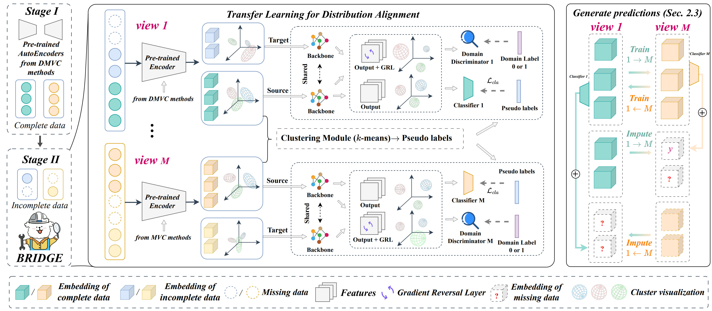
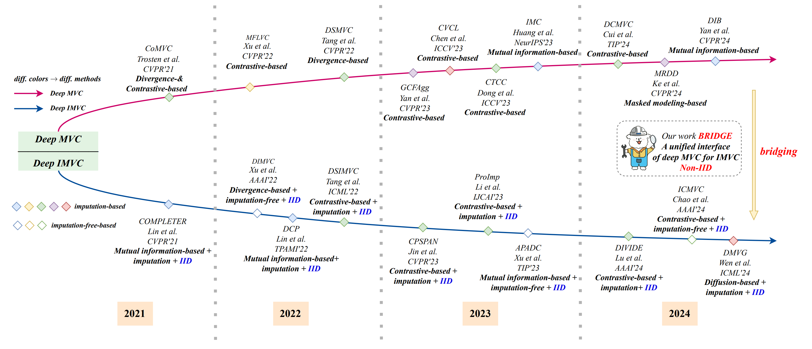

# BRIDGE


## Introduction

This project contains the code for the ICCV 2025 paper *BRIDGE*. Our goal is to build a bridge from DMVC to DIMVC, empowering existing representation learning-based DMVC methods to adapt to DIMVC tasks.

> [A Unified Framework to BRIDGE Complete and Incomplete Deep Multi-View Clustering under Non-IID Missing Patterns]()




Our motivation is grounded in previous state-of-the-art DMVC and DIMVC methods, which provide a solid foundation for our work:



## Dataset

The dataset could be downloaded from [cloud](https://drive.google.com/file/d/1thvU6d0Xf0rC-Nz5U02XxZzaZeMjJed-/view?usp=sharing).

## Training

This code provides:

- three classical DMVC training methods: contrastive learning-based, mutual information maximization-based, and KL-divergence-based approaches.


- an interface module that bridges DMVC to DIMVC.

```bash
python train.py
```
## Non-IID missing patterns

Please set `args.build_your_own_dimvc` to `True` in order to use the Non-IID missing data mode.

We provide two different Non-IID missing data patterns. Please refer to `dataloader.py`.


By default, the following is used:
```bash
self.X, self.Y, self.X_i, self.Y_i, self.index = Form_Incomplete_Data(
    seed, 
    missrate=miss_rate, 
    X=[self.X1, self.X2], 
    Y=[labels for _ in range(self.view)]
)
self.X_i = add_pure_random_noniid_noise(self.X_i)
```

Alternatively, you can modify it to use:
```bash
self.X, self.Y, self.X_i, self.Y_i, self.index = Form_Incomplete_Data_NonIID(
    seed, 
    missrate=miss_rate, 
    X=[self.X1, self.X2], 
    Y=[labels for _ in range(self.view)]
)
```

## Build Your Own DIMVC Method
We support the integration of representation learning-based DMVC methods to enable their adaptation to DIMVC tasks. 

To achieve this, you need to:

- Step 1: Train your own DMVC method, such as [GCFAggMVC](https://github.com/Galaxy922/GCFAggMVC), and save the model. 
   We recommend saving the full model, for example: ` torch.save(model, './models/' + args.dataset + '.pth')`
  
  **Note**: 
  
  At this stage, the original DMVC method needs to be trained using only a subset of the data (rather than the entire dataset). However, most DMVC methods do not provide functionality for handling missing data (since it is generally unnecessary). To avoid complicated steps, we provide a very simple implementation idea, for example:
 
    ```bash
    class BDGP(Dataset):
        def __init__(self, path):
            data1 = scipy.io.loadmat(path + 'BDGP.mat')['X1'].astype(np.float32)
            data2 = scipy.io.loadmat(path + 'BDGP.mat')['X2'].astype(np.float32)
            labels = scipy.io.loadmat(path + 'BDGP.mat')['Y'].transpose()
            size = data1.shape[0]
            miss_rate = 0.5
            self.x1 = data1[0:int(size * (1-miss_rate))]
            self.x2 = data2[0:int(size * (1-miss_rate))]
            self.y = labels[0:int(size * (1-miss_rate))]
            ...
    ```
  
    Your DMVC method will thus only use the first `(1 - miss_rate)` portion of the dataset during training.
    Later, when training with BRIDGE, comment out the line `random.shuffle(t)` in `Form_Incomplete_Data(seed, missrate, X, Y)` within `BRIDGE/dataloader.py`. This ensures that BRIDGE does not randomly shuffle the dataset and also uses the first `(1 - miss_rate)` portion as the complete data, thereby achieving aligned dataset partitioning.
    
    **Important:**
    
     (1) If you enable shuffling, the data order will be lost, and additional functionality is required to record dataset allocation for alignment. 
     
     (2) So, please **comment out** `random.shuffle(t)` in `Form_Incomplete_Data(seed, missrate, X, Y)` within `BRIDGE/dataloader.py` in advance and do not shuffle your dataset, unless you have implemented additional measures to ensure that the dataset partitioning remains aligned.
    
     (3) This method does **not** work under a non-iid missing data pattern.
    


- Step 2: Copy the model network code of the DMVC method you used into `BRIDGE/network.py`. 
   This step is necessary because BRIDGE needs to access the model class definition. 
   
   ```
  For example, if you used GCFAggMVC, its network structure is defined in the class `GCFAggMVC(nn.Module)`.
  If you skip this, the code will raise errors when trying to load the saved model.
   ```
  ⚠ **Note**: 
  
  The `forward` function of BRIDGE returns `hs, qs, xrs, zs`. 
When copying your DMVC network code, make sure to keep it consistent. 
For example, modify the `forward` function of `GCFAggMVC` to return `hs, -1, xrs, zs`, 
where `-1` serves as a placeholder for `qs`.

- Step3: Move the trained `.pth` model file to `BRIDGE/models/`, and set `args.build_your_own_dimvc` to `True`.


## Acknowledgements
This repository is built upon [MFLVC](https://github.com/SubmissionsIn/MFLVC).

We would like to thank the many previous open-source works on DMVC and DIMVC. 

For any questions, please feel free to contact us at xrjiang@mail.ustc.edu.cn